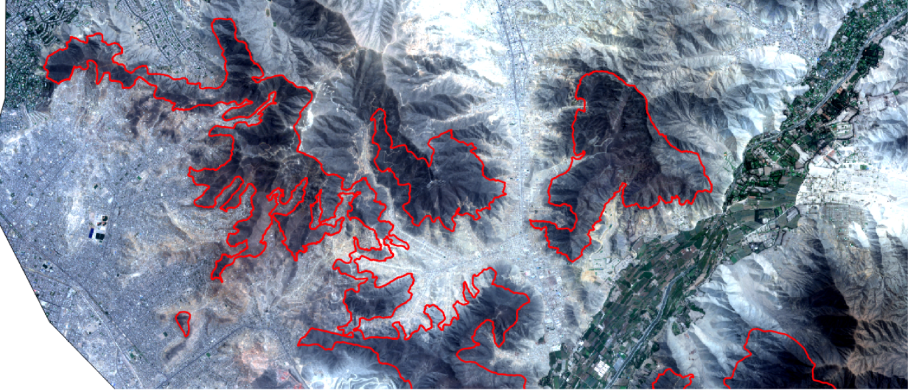
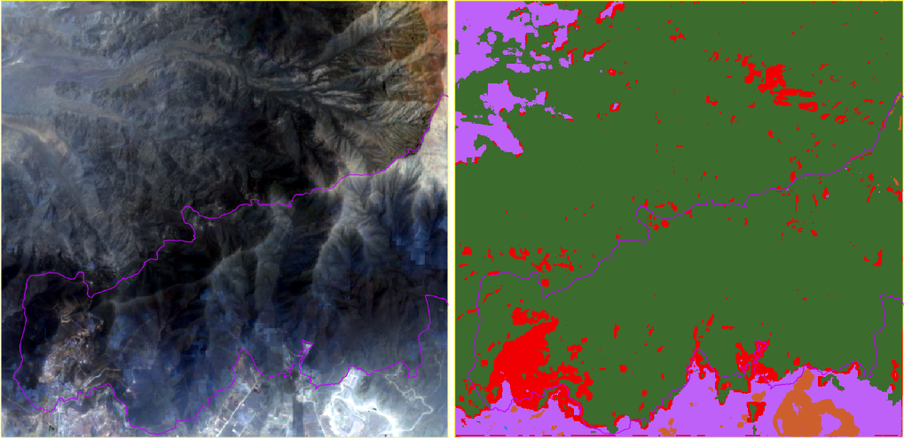
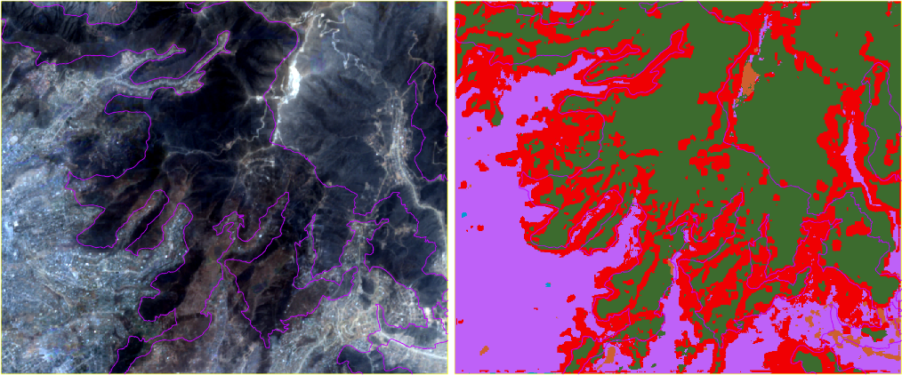

# Metodología

## Modelo de clasificación de cobertura del suelo para invasiones

En esta sección se detallan las fuentes de datos que están siendo utilizadas
para el modelo de clasificación de cobertura del suelo, los procedimientos
para calibrar las imágenes, y los resultados preliminares del modelo de
aprendizaje automático aplicado.

### Fuentes de datos

#### Imágenes satelitales

Para analizar el problema a partir de las imágenes satelitales disponibles
para el proyecto, se prepararon y descargaron mosaicos trimestrales de
escenas del sensor Sentinel-2 (ESA), desde el año 2015 hasta noviembre del
año 2019, de todo el ecosistema de las Lomas.

La resolución espacial de las imágenes de Sentinel-2 es de 10m por pixel para
las bandas RGB (rojo, verde y azul) y NIR (infrarrojo cercano), y de 20m para
el resto de las bandas del infrarrojo. El tiempo de revisita es de
aproximadamente 10 días.




A partir de la inspección visual, se consensuó con el equipo de EbA Lomas el
uso de mosaicos bimestrales de escenas de Sentinel-2. En el caso de que haya
regiones cubiertas por nubes en algún momento del año, se completará con
escenas de Sentinel-1. Este sensor es muy utilizado en la práctica para
detectar inundaciones o edificaciones, dado que permite observar el suelo aún
con nubosidad.


Las imágenes de Sentinel-1 y Sentinel-2 se descargaron de los repositorios
abiertos de Copernicus Open Access Hub.

También se utilizó el modelo de elevación digital (DEM) del SRTM (Shuttle
Radar Topography Mission), puesto que la información de altitud es relevante
a la hora de determinar suelo de las Lomas. La resolución espacial de esta
capa ráster es de 30 m por píxel aproximadamente (1-arc second).


#### Datos vectoriales

Se está trabajando sobre un conjunto de capas vectoriales de polígonos
proporcionados por el equipo de EbA Lomas.

El área de interés (AOI) donde se analizan cambios de cobertura de suelo,
tanto de vegetación como de invasiones de tierras, está basado en el
shapefile **El Niño Southern Oscillation (ENSO) 1997-1998 Lomas**. Éste
representa la máxima extensión en los últimos 20 años de precipitaciones
inusuales, y fue obtenida de imágenes del sensor TM del Landsat-5. Se tomó un
buffer para contemplar posibles expansiones.

También se utilizaron los siguientes shapefiles como referencia para hacer
anotaciones de verdad de campo:

* **Lomas anuales**. Es la superficie que se vuelve
verde en la temporada de niebla (Junio-Septiembre)
* **2016-2018 Informal Settlements**
* **2017-2019 Waste Pile**

### Preprocesamiento de imágenes

#### Sentinel-2

Para poder utilizar las imágenes multiespectrales de Sentinel-2 y las
imágenes SAR de Sentinel-1 fue necesario aplicar una serie de pasos de
calibración.

Dado que se descargaron escenas de nivel L1C para Sentinel-2, fue necesario
ejecutar la herramienta de código abierto sen2cor, provista por la plataforma
de la ESA. Este proceso realiza las correcciones atmosféricas y geométricas
de las escenas y genera una versión de las imágenes a nivel
bottom-of-atmosphere, designado como nivel L2A.

También genera una máscara de nubes, que luego utilizamos para descartar
aquellos píxeles de la imagen que están cubiertos de nubes. Estos píxeles no
son válidos para el modelo, y serán reemplazados por los de la imagen de
Sentinel-1 del período correspondiente.

Para generar el mosaico, aplicamos la herramienta de código abierto
sen2mosaic, para Python.

#### Sentinel-1

Para trabajar con las imágenes de este sensor para la detección de
edificaciones y cambios en la cobertura del suelo, se descargaron escenas del
producto GRD (Ground Range Detected) donde los valores de los píxeles
representan la magnitud detectada. La resolución espacial de estas imágenes
es de aproximadamente 10m por píxel.

Luego de descargar los productos se procede con la calibración radiométrica,
que permite calcular el valor sigma0 de las bandas de polarización VV y VH.
Al hacer esta calibración, también se utiliza el DEM de SRTM para
ortorectificar las imágenes. El segundo paso es la eliminación del ruido
Speckle con la aplicación de un filtro específico para este tipo de ruido,
característico en las imágenes SAR.

El siguiente paso que realizamos es calcular la proporción VV/VH a partir de
las bandas VV y HH, que es un atributo que utiliza el modelo de cobertura de
suelo.

Finalmente se concatenan las 3 bandas en una sola imagen, y se corregistran
de a pares de escenas con la herramienta AROSICS. Este paso es necesario para
luego poder generar el mosaico en base a todas las escenas descargadas.
Finalmente se recorta la imagen con la capa vectorial del AOI.

### Armado del dataset

Los datasets de entrenamiento y evaluación del modelo se definieron de la
siguiente manera:

* Imágenes de todo un año completo, desde noviembre del 2018 a noviembre del
  2019 inclusive.
* Mosaicos bimestrales, de tres (3) períodos distintos de ese año.
* Cuatro (4) áreas definidas
* Para cada mosaico de entrenamiento hay un mosaico de evaluación exactamente
  dos meses después, cubriendo así todos los períodos del año.

A continuación se detallan los rangos de fecha utilizados para los datasets:

* *Train*
  1. 2018-11 al 2018-12
  2. 2019-03 al 2019-04
  3. 2019-07 al 2019-08
* *Test*
  1. 2019-01 al 2019-02
  2. 2019-05 al 2019-06
  3. 2019-09 al 2019-10

Las bandas utilizadas de cada sensor fueron las siguientes:
* **Sentinel-2**: 10 bandas multiespectrales
    - B2 (490 nm), B3 (560 nm), B4 (665 nm) y B8 (842 nm), de 10m por píxel
    - B5 (705 nm), B6 (740 nm), B7 (783 nm), B8a (865 nm), B11 (1610 nm) y B12 (2190 nm), de 20m por píxel
* **Sentinel-1**: 3 bandas:
    - VV, VH
    - VV/HH
* **SRTM**: DEM, altitud en msnm

Para cada banda, se extrajeron los siguientes atributos utilizando la
herramienta de código abierto Orfeo Toolbox:

* **Estadísticas locales**: 4 momentos estadísticos en la vecindad de cada
  pixel
    - Media
    - Varianza
    - Skewness (asimetría)
    - Curtosis
* **Atributos de textura de Haralick**: 8 atributos locales
    - Energy (texture uniformity)
    - Entropy (measure of randomness of intensity image)
    - Correlation (how correlated a pixel is to its neighborhood)
    - Inverse Difference Moment (measures the texture homogeneity)
    - Inertia (intensity contrast between a pixel and its neighborhood)
    - Cluster Shade
    - Cluster Prominence
    - Haralick Correlation

### Entrenamiento preliminar y evaluación

Para evaluar la importancia de las bandas seleccionadas y los atributos
extraídos, se entrenó un modelo de cobertura de suelo para las 4 áreas
asignadas.

Se anotaron polígonos para las siguientes clases:
- Suelo de loma natural
- Suelo de loma artificial / movimiento de suelo
- Área urbana
- Suelo desnudo
- Vegetación / campo
- Agua

Para cada uno de los mosaicos de cada período, se cortó el raster a medida
con la unión de las extensiones de las 4 áreas (para que los subsiguientes
procesos sean más eficientes en memoria y cómputo), y se extrajeron los
atributos de cada una de estas imágenes. Se generaron 3 Shapefiles como
resultado (1 por cada período), que fueron fusionados para obtener un único
Shapefile de puntos con atributos.

Finalmente, se utilizó Orfeo Toolbox para entrenar un random forest a partir
de las anotaciones, y los atributos extraídos anteriormente.  Luego de ajustar
los hiperparámetros del modelo, se alcanzó un kappa de 0.89.

A continuación se muestran las métricas y matrices de confusión de la mejor
ejecución.

Parámetros:

* Profundidad: 9
* Árboles: 175

```
Predicted list size : 92358
ValidationLabeledListSample size : 92358
Training performances:
Confusion matrix (rows = reference labels, columns = produced labels):
```

|   | 1     | 2     | 3     | 4     | 5     | 6     |
|---|-------|-------|-------|-------|-------|-------|
| 1 | 14316 |   798 |   255 |    24 |     0 |     0 |
| 2 |  1035 | 12051 |  2082 |   105 |     0 |   120 |
| 3 |    90 |   978 | 13623 |   324 |    42 |   336 |
| 4 |     9 |   402 |  1581 | 13362 |    21 |    18 |
| 5 |     0 |     0 |     0 |     0 | 15393 |     0 |
| 6 |     0 |     0 |   129 |    12 |     6 | 15246 |

```
Precision of class [1] vs all: 0.926602
Recall of class    [1] vs all: 0.930033
F-score of class   [1] vs all: 0.928314

Precision of class [2] vs all: 0.846932
Recall of class    [2] vs all: 0.782888
F-score of class   [2] vs all: 0.813652

Precision of class [3] vs all: 0.770968
Recall of class    [3] vs all: 0.885013
F-score of class   [3] vs all: 0.824063

Precision of class [4] vs all: 0.96637
Recall of class    [4] vs all: 0.868057
F-score of class   [4] vs all: 0.914579

Precision of class [5] vs all: 0.995537
Recall of class    [5] vs all: 1
F-score of class   [5] vs all: 0.997764

Precision of class [6] vs all: 0.969847
Recall of class    [6] vs all: 0.99045
F-score of class   [6] vs all: 0.98004

Global performance, Kappa index: 0.891288
```

A continuación se observan las cuatro áreas sobre un mosaico de Sentinel-2 y
el resultado del clasificador correspondiente.






## Modelo de detección de vegetación

### Fuentes de datos

El modelo de detección de vegetación utiliza imágenes satelitales MODIS, en
particular el producto MOD13Q1.006, que cuenta con resolución espacial de
250m y temporal de 16 días. Se cuenta con una imagen por mes, desde enero
2014 a noviembre 2019.

Las imágenes MODIS se complementan con el modelo de elevación digital (DEM)
del SRTM, mencionado anteriormente.

Además se cuenta con la definición del área de análisis propuesta por el
equipo de EbA Lomas. Para definir la misma, en el ámbito de las provincias de
Lima y Callao, se consideró lo siguiente:

* Áreas localizadas entre los 200 y 1800 msnm conforme al artículo de León
  (2017). Las curvas de nivel fueron extraídas de la carta nacional 1:100 000
  del Instituto Geográfico Nacional.
* Exclusión de zonas con presencia de campos agrícolas, forestación densa de
  laderas aledañas a zonas urbanas y/o agrícolas, empleando una imagen Spot
  (2017).
* Exclusión de zonas urbanas consolidadas con un buffer de 30m de acuerdo al
  INEI (2016).

### Metodología

En primer lugar se recortaron las imágenes MODIS y SRTM al área de estudio
propuesta por el equipo de EbA Lomas.

Partiendo de los datos MODIS del área a monitorear, se determinó mediante un
umbral NDVI aquellos pixeles que representaban vegetación. Dicho umbral fue
definido en 0.2, tomando como fuente al artículo de León (2017), donde se
indica que un valor inferior a 0.2 representa suelo desnudo.

Luego con las imágenes SRTM del área a monitorear, se determinó la presencia
o no de las Lomas. Tomando como Lomas los lugares con altura entre 200 y 1800
msnm.

Finalmente consideramos como información relevante para la capa verde,
aquellos píxeles que cumplen ambas condiciones, es decir presentan tanto
vegetación como las condiciones que definen a la Loma.

Se genera como resultado, para cada mes, dos tipos de capas ráster:
* Rango NDVI: resultado complementario, donde se discretizan los valores NDVI
  en 4 rangos.
* Máscara Verde: un valor 0 o 1 para cada píxel, según cumple las condiciones
  mencionadas anteriormente.
* Máscara de Nubes: determina si un pixel fue considerado como nube en el
  producto original de MODIS.

Luego de un análisis posterior de los resultados, se incluyó un paso de
postprocesamiento que aplica una máscara conformada por polígonos, con el
objetivo de excluir vegetación no relacionada al ecosistema de Lomas (por
ejemplo: zonas agrícolas, urbanas, periurbanas).

Por otro lado, debido a que la resolución del producto MODIS es muy baja, en
determinados casos se terminan incluyendo áreas con vegetación en los bordes
de zonas agrícolas. Con el fin de resolver este problema, se aplicó un buffer
para reducir el área de inclusión en los bordes y evitar este problema.

La máscara de nubes se genera extrayendo los píxeles catalogados como "nube"
en el dataset *Pixel reliability* del producto MOD13Q1.

Para más información acerca del producto MOD13Q1 se recomienda leer la [Guia
de Usuario][1].


  [1]: https://vip.arizona.edu/documents/MODIS/MODIS_VI_UsersGuide_June_2015_C6.pdf
