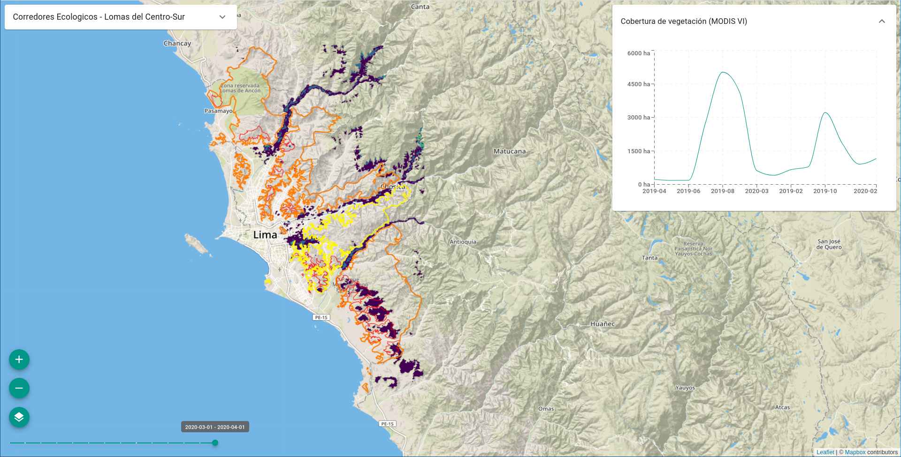
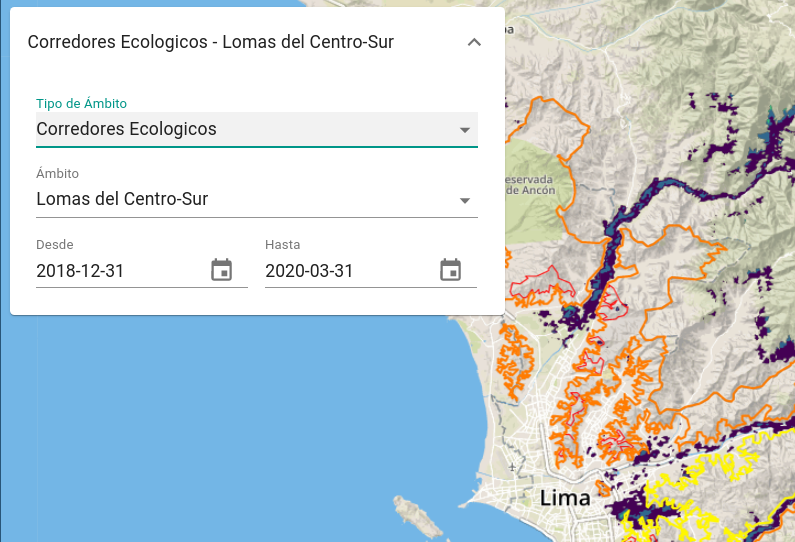
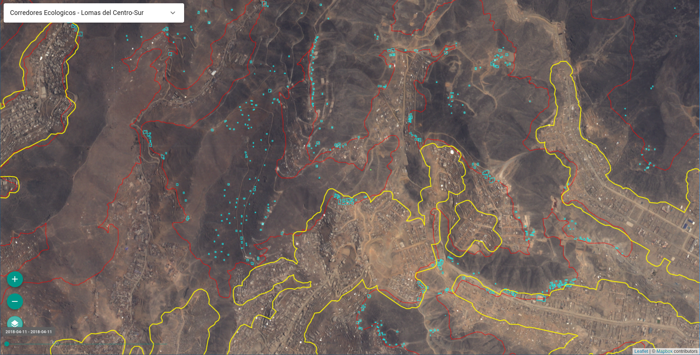

# Guía de Uso

En esta sección se describen las diferentes vistas que conforman el frontend
de la plataforma, y de qué manera se pueden utilizar las herramientas
provistas para visualizar y analizar los resultados de los procesos
automáticos aplicados sobre imágenes satelitales y de las estaciones
meteorológicas.

Este texto está dirigido tanto para usuarios anónimos, como para usuarios
registrados y aquellos con el rol de administrador.

## Inicio

En la página de inicio se listan diferentes componentes que forman parte de
la plataforma. Desde aquí se puede acceder a los mapas del módulo de
Observación Terrestre, como el mapa de **Cobertura Verde** o el mapa de **Cobertura
de Loma Perdida**, y por otro lado, al Mapa y el **Dashboard** del módulo de
Estaciones Meteorológicas.

## Observación terrestre

### Cobertura Verde

El mapa de cobertura verde presenta la capa de cobertura de vegetación del
ecosistema de las Lomas, basada en el producto de MODIS de índices de
vegetación (MOD13Q1).

En la esquina superior izquierda se encuentra el control de Filtro, que
permite filtrar los resultados de la serie de tiempo para un ámbito y un
rango de fechas específico:

Desde el selector de Tipo de Ámbito se puede seleccionar un tipo de ámbito.
Al seleccionar uno, en el mapa se actualizará la capa de ámbitos del tipo
seleccionado.

También se puede ajustar la fecha de comienzo y fin de la serie de tiempo.
Por defecto, se toma la primer fecha y última fecha con datos cargados en la
base de datos.

Por defecto se visualiza la capa NDVI, pero también es posible visualizar en
simultaneo una máscara de vegetación, resultado de la umbralización de la
capa NDVI, (*Vegetation mask*) y una máscara de nubes (*Cloud Mask*),
extraída del mismo producto de MODIS. Estas capas se pueden activar o
desactivar haciendo clic en el ícono de Capas en la esquina inferior
izquierda, y en cada casillero.

También es posible ajustar la opacidad de cada capa ajustando el control
deslizante al lado del nombre de la capa.

Debajo del ícono de Capas, se encuentra el control de Selección de Períodos,
que permite seleccionar una fecha en particular, para visualizar las capas de
ese período en el mapa.

!!! note "Nota"

    Esta selección de fecha sólo afecta a las capas visualizadas en el mapa,
    no a la serie de tiempo. Para ajustar las fechas de la serie de tiempo,
    debe hacerlo desde el control de Filtro.

### Cobertura de Loma Perdida

La vista de cobertura de Loma Perdida funciona de manera similar al mapa de
Cobertura Verde.  Las capas disponibles en este caso son:

* *Loss mask*: Máscara de loma perdida. Resultado del producto de clasificación
  de cobertura de loma perdida.
* *Sentinel-1*: Imagen en color falso del mosaico de Sentinel-1 para el período
  actual. Las bandas utilizadas fueron VV, VH y la proporción VV/VH como
  rojo, verde y azul respectivamente.
* *Sentinel-2*: Imagen en color verdadero del mosaico de Sentinel-2 para el
  período actual.

### Detección de Cambios

En esta vista se visualiza el producto del modelo de detección de objetos
para escenas del satélite PeruSat-1.

## Estaciones Meteorológicas

### Mapa

### Dashboard

## Usuarios

### Reglas

#### Reglas de Parámetro

#### Reglas de Tipo de Ámbito

#### Reglas de Ámbito

### Alertas

#### Diagrama de verificación de regla

#### Diagrama para reglas de parámetro

#### Diagrama para reglas de tipo de ámbito

#### Diagrama para reglas de ámbito

### Imágenes

### Perfil

## Administradores

### Panel de administración

### Usuarios

### Ámbitos

### Estaciones meteorológicas

### Auditoría

