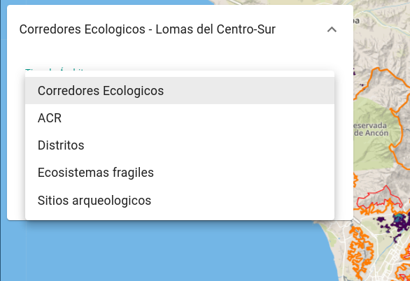

# Uso

En esta sección se describen las diferentes vistas que conforman el frontend
de la plataforma, y de qué manera se pueden utilizar las herramientas
provistas para visualizar y analizar los resultados de los procesos
automáticos aplicados sobre imágenes satelitales y de las estaciones
meteorológicas.

Este texto está dirigido tanto para usuarios anónimos, como para usuarios
registrados y aquellos con el rol de administrador.

## Inicio

En la página de inicio se listan diferentes componentes que forman parte de
la plataforma. Desde aquí se puede acceder a los mapas del módulo de
Observación Terrestre, como el mapa de Cobertura Verde o el mapa de Cobertura
de Loma Perdida, y por otro lado, al Mapa y el Dashboard del módulo de
Estaciones Meteorológicas.

## Observación terrestre

### Cobertura Verde

### Cobertura de Loma Perdida

### Detección de Cambios

## Estaciones Meteorológicas

### Mapa

### Dashboard

## Usuarios

### Reglas
### Alertas
### Imágenes
### Perfil

## Administradores

### Panel de administración

### Usuarios

### Ámbitos

### Estaciones meteorológicas

### Auditoría

