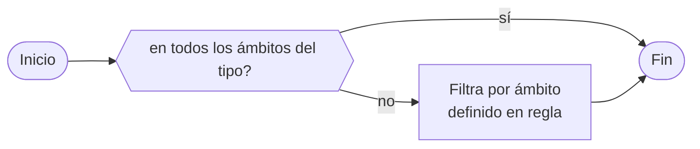

# Guía de Uso

En esta sección se describen las diferentes vistas que conforman el frontend
de la plataforma, y de qué manera se pueden utilizar las herramientas
provistas para visualizar y analizar los resultados de los procesos
automáticos aplicados sobre imágenes satelitales y de las estaciones
meteorológicas.

Este texto está dirigido tanto para usuarios anónimos, como para usuarios
registrados y aquellos con el rol de administrador.

## Inicio

En la página de inicio se listan diferentes componentes que forman parte de
la plataforma. Desde aquí se puede acceder a los mapas del módulo de
Observación Terrestre, como el mapa de **Cobertura Verde** o el mapa de **Cobertura
de Loma Perdida**, y por otro lado, al Mapa y el **Dashboard** del módulo de
Estaciones Meteorológicas.

## Observación terrestre

### Cobertura Verde

El mapa de cobertura verde presenta la capa de cobertura de vegetación del
ecosistema de las Lomas, basada en el producto de MODIS de índices de
vegetación (MOD13Q1).

En la esquina superior izquierda se encuentra el control de Filtro, que
permite filtrar los resultados de la serie de tiempo para un ámbito y un
rango de fechas específico:

Desde el selector de Tipo de Ámbito se puede seleccionar un tipo de ámbito.
Al seleccionar uno, en el mapa se actualizará la capa de ámbitos del tipo
seleccionado.

También se puede ajustar la fecha de comienzo y fin de la serie de tiempo.
Por defecto, se toma la primer fecha y última fecha con datos cargados en la
base de datos.

Por defecto se visualiza la capa NDVI, pero también es posible visualizar en
simultaneo una máscara de vegetación, resultado de la umbralización de la
capa NDVI, (*Vegetation mask*) y una máscara de nubes (*Cloud Mask*),
extraída del mismo producto de MODIS. Estas capas se pueden activar o
desactivar haciendo clic en el ícono de Capas en la esquina inferior
izquierda, y en cada casillero.

También es posible ajustar la opacidad de cada capa ajustando el control
deslizante al lado del nombre de la capa.

Debajo del ícono de Capas, se encuentra el control de Selección de Períodos,
que permite seleccionar una fecha en particular, para visualizar las capas de
ese período en el mapa.

!!! tip "Filtro vs. selector de fechas"

    Esta selección de fecha sólo afecta a las capas visualizadas en el mapa,
    no a la serie de tiempo. Para ajustar las fechas de la serie de tiempo,
    debe hacerlo desde el control de Filtro.

### Cobertura de Loma Perdida

La vista de cobertura de Loma Perdida funciona de manera similar al mapa de
Cobertura Verde.  Las capas disponibles en este caso son:

* *Loss mask*: Máscara de loma perdida. Resultado del producto de clasificación
  de cobertura de loma perdida.
* *Sentinel-1*: Imagen en color falso del mosaico de Sentinel-1 para el período
  actual. Las bandas utilizadas fueron VV, VH y la proporción VV/VH como
  rojo, verde y azul respectivamente.
* *Sentinel-2*: Imagen en color verdadero del mosaico de Sentinel-2 para el
  período actual.

!!! info "Fusión de vistas"

    Próximamente esta vista será fusionada junto con la de Detección de
    Cambios en una única vista Detección de Cambios en Lomas.

### Detección de Objetos

En esta vista se visualiza el producto del modelo de detección de objetos
para escenas del satélite PeruSat-1.

Este producto consiste en una capa vectorial, donde se localizan objetos de
interés, relacionados a actividad no monitoreada e invasión de tierras sobre
las Lomas.

!!! info "Objetos de interés"

    Por el momento el modelo detecta *techos de viviendas informales*. Se
    está desarrollando un nuevo modelo de detección con otros objetos y
    patrones visuales.

!!! info "Fusión de vistas"

    Próximamente esta vista será fusionada junto con la de Covertura de Loma
    perdida en una única vista Detección de Cambios en Lomas.

## Estaciones Meteorológicas

La plataforma incluye un módulo de estaciones meteorológicas, donde se
almacenan, analizan y visualizan mediciones recolectadas por sensores
terrestres, instalados en diferentes localidades del ecosistema.

### Mapa

Desde el frontend se pueden acceder a un mapa de Estaciones, donde todas las
estaciones cargadas en la base de datos se ubican con marcadores en el mapa.

Al cargar, el mapa se centra de tal manera de poder mostrar todos los
marcadores en pantalla. Si desea buscar una estación por nombre o por nombre
del lugar donde está instalado, haga clic en el ícono Buscar ("lupa"), en la
esquina superior izquierda. Se desplegará al costado izquierdo un buscador
donde podrá ingresar parte del nombre del lugar o de la estación. Los
resultados aparecerán automaticamente en la lista debajo del cuadro de
entrada.

Si hace clic sobre un marcador en el mapa, se abrirá una ventana indicando el
nombre y código de la estación, y su lugar. También se mostrará, a modo de
previsualización, un gráfico de serie de tiempo de un parámetro de los
sensores de la estación. Puede cambiar de parámetro haciendo clic sobre el
selector que se encuentra arriba del gráfico.

Haciendo clic en el botón Dashboard podrá ingresar al dashboard de esa
estación seleccionada.

### Dashboard

En esta vista se presentan una serie de gráficos de series de tiempo para
cada parámetro recolectado por los sensores de una estación en particular.
Por ejemplo, en los sensores instalados actualmente, se están recolectando
estos parámetros:

- Temperatura de Ambiente (°C)
- Humedad Relativa (%)
- Velocidad del Viento (m/s)
- Dirección del Viento (grados)
- Presión Atmosférica (mbar)
- Precipitaciones (niebla)
- Material Particulado (PM2.5)

En la esquina superior derecha se encuentran dos controles de filtrado, que
determinan qué datos se graficarán en el dashboard: *estacion* y *tiempo*.

#### Estación

Este control filtra las mediciones para una estación en particular.

Haciendo clic, se abrirá una ventana con un selector de estaciones. Al
seleccionarla, se actualizaran automaticamente todos los gráficos.

#### Tiempo

Este control maneja varios aspectos del filtrado y visualización de las
mediciones en el dashboard.

Posee dos modos de functionamento:
* **Tiempo Real**: Toma las mediciones hace cierta cantidad de tiempo hasta
  ahora. En este modo los datos en la página se actualizan automáticamente,
  sin necesidad de refrescarla.

* **Histórico**: Toma las mediciones y las filtra en un rango de tiempo
  (desde-hasta).  Permite trabajar con datos históricos.

Ambos modos de operación tienen dos controles en común que determinan su
funcionamiento:

* **Intervalo de agrupación**: Define el interval en el que se agruparán los
  datos. Por ejemplo: hora, día, semana, mes, año.
* **Función de agregación de tiempo**: Define la función que se aplicará a cada
  grupo de mediciones por intervalo. Por ejemplo: promedio, máximo, mínimo,
  etc.

### Tabla

Esta vista es muy similar al dashboard, dado que se presentan los datos de
mediciones de una estación en particular, pero en formato de tabla. A
diferencia del dashboard, la tabla tiene como columna cada uno de los
parámetros, y como fila cada medición

Posee los mismos controles de filtrado que el dashboard (control de Estación
y de Tiempo), y en todo momento se puede dirigir de la vista de tabla al
dashboard y vice versa, mantiendo la configuración de filtro, haciendo clic
en *Dashboard*, en la esquina superior izquierda.

Por otro lado, haciendo clic en *Descargar*, se podrá descargar la tabla en
formato CSV (valores separados por coma), document que puede ser abierto en
otras aplicaciones como planillas de cálculo.

## Usuarios

Aquellos usuarios que hayan sido invitados y registrados en la plataforma por
un administrador, podrán acceder a un panel de usuario y al sistema de
Alertas. Puede iniciar sesión en todo momento hacinedo clic en el botón
*Iniciar Sesión*, que se encuentra en la esquina superior derecha.

Luego ingrese su nombre de usuario y contraseña, y haga clic en *Ingresar*.

Si no recuerda su contraseña, puede reestablecerla haciendo clic en
*Solicitar una nueva* e ingresando la dirección de email con la que fue
registrado. Al aceptar, se le enviará a su casilla un email con instrucciones
para reestablecer su contraseña.

Una vez que está autenticado, notará que en el lugar donde antes estaba el
botón *Iniciar sesión* ahora hay dos íconos:

* **Alertas** (campana): Indica nuevas alertas (no vistas), y muestra una lista de
  las últimas 5 notificaciones generadas.
* **Perfil**: Permite acceder al panel de usuario, al perfil de usuario y cerrar la
  sesión.

### Reglas

#### Reglas de Parámetro

#### Reglas de Tipo de Ámbito

#### Reglas de Ámbito

### Alertas

#### Diagrama de verificación de regla

#### Diagrama para reglas de parámetro

#### Diagrama para reglas de tipo de ámbito

#### Diagrama para reglas de ámbito

### Imágenes

### Perfil

## Administradores

### Panel de administración

### Usuarios

### Ámbitos

### Estaciones meteorológicas

### Auditoría

