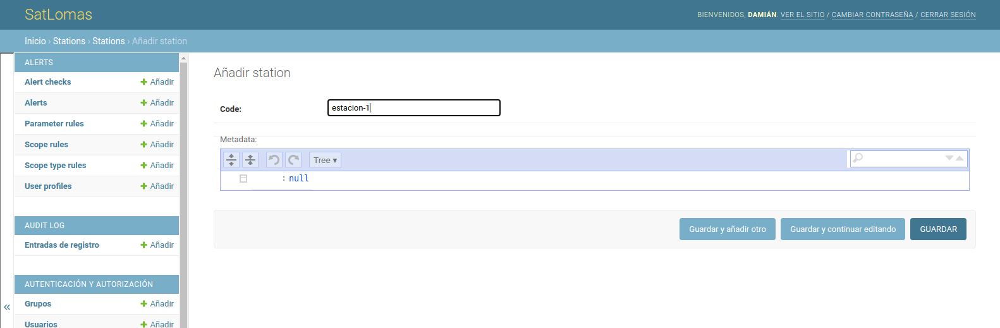

# Guía de Uso

En esta sección se describen las diferentes vistas que conforman el frontend
de la plataforma, y de qué manera se pueden utilizar las herramientas
provistas para visualizar y analizar los resultados de los procesos
automáticos aplicados sobre imágenes satelitales y de las estaciones
meteorológicas.

Este texto está dirigido tanto para usuarios anónimos, como para usuarios
registrados y aquellos con el rol de administrador.

## Inicio

En la página de inicio se listan diferentes componentes que forman parte de
la plataforma. Desde aquí se puede acceder a los mapas del módulo de
Observación Terrestre, como el mapa de **Cobertura Verde** o el mapa de **Cobertura
de Loma Perdida**, y por otro lado, al Mapa y el **Dashboard** del módulo de
Estaciones Meteorológicas.

## Observación terrestre

### Cobertura Verde

El aplicativo de mapa de cobertura verde presenta la capa de cobertura de vegetación del
ecosistema de lomas, basada en el producto de MODIS de índices de
vegetación (MOD13Q1).

En la esquina superior izquierda se encuentra el control de Filtro, que
permite filtrar los resultados de la serie de tiempo para un ámbito y un
rango de fechas específico:

Desde el selector de Tipo de Ámbito se puede seleccionar un tipo de ámbito.
Al seleccionar uno, en el mapa se actualizará la capa de ámbitos del tipo
seleccionado.

También se puede ajustar la fecha de comienzo y fin de la serie de tiempo.
Por defecto, se toma la primer fecha y última fecha con datos cargados en la
base de datos.

Por defecto se visualiza la capa NDVI, pero también es posible visualizar en
simultaneo una máscara de vegetación, resultado de la umbralización de la
capa NDVI, (*Vegetation mask*) y una máscara de nubes (*Cloud Mask*),
extraída del mismo producto de MODIS. Estas capas se pueden activar o
desactivar haciendo clic en el ícono de Capas en la esquina inferior
izquierda, y en cada casillero.

También es posible ajustar la opacidad de cada capa ajustando el control
deslizante al lado del nombre de la capa.

Debajo del ícono de Capas, se encuentra el control de Selección de Períodos,
que permite seleccionar una fecha en particular, para visualizar las capas de
ese período en el mapa.

!!! tip "Filtro vs. selector de fechas"

    Esta selección de fecha sólo afecta a las capas visualizadas en el mapa,
    no a la serie de tiempo. Para ajustar las fechas de la serie de tiempo,
    debe hacerlo desde el control de Filtro.

### Cobertura de Loma Perdida

La vista de cobertura de Loma Perdida funciona de manera similar al mapa de
Cobertura Verde.  Las capas disponibles en este caso son:

* *Loss mask*: Máscara de loma perdida. Resultado del producto de clasificación
  de cobertura de loma perdida.
* *Sentinel-1*: Imagen en color falso del mosaico de Sentinel-1 para el período
  actual. Las bandas utilizadas fueron VV, VH y la proporción VV/VH como
  rojo, verde y azul respectivamente.
* *Sentinel-2*: Imagen en color verdadero del mosaico de Sentinel-2 para el
  período actual.

!!! info "Fusión de vistas"

    Próximamente esta vista será fusionada junto con la de Detección de
    Cambios en una única vista Detección de Cambios en Lomas.

### Detección de Objetos

En esta vista se visualiza el producto del modelo de detección de objetos
para escenas del satélite PeruSat-1.

Este producto consiste en una capa vectorial, donde se localizan objetos de
interés, relacionados a actividad no monitoreada e invasión de tierras sobre
las Lomas.

!!! info "Objetos de interés"

    Por el momento el modelo detecta *techos de viviendas informales*. Se
    está desarrollando un nuevo modelo de detección con otros objetos y
    patrones visuales.

!!! info "Fusión de vistas"

    Próximamente esta vista será fusionada junto con la de Covertura de Loma
    perdida en una única vista Detección de Cambios en Lomas.

## Estaciones Meteorológicas

La plataforma incluye un módulo de estaciones hidrometeorológicas ligeras, donde
se almacenan, analizan y visualizan mediciones recolectadas por sensores de
clima acoplados a un recolector de neblina estándar, instalados en diferentes
localidades o *sitios* del ecosistema.  Estos sensores automáticos envían a
través de un nodo Lorawan la información en tiempo real a la plataforma.

### Mapa

Desde el frontend se pueden acceder a un mapa de Sitios, donde se presentan
todos los sitios en donde se instalaron estaciones y se recolectaron datos en la
historia, y se ubican con con marcadores en el mapa.

Al cargar, el mapa se centra de tal manera de poder mostrar todos los
marcadores en pantalla. Si desea buscar un sitio por nombre o por nombre
del lugar donde está instalado, haga clic en el ícono Buscar ("lupa"), en la
esquina superior izquierda. Se desplegará al costado izquierdo un buscador
donde podrá ingresar parte del nombre del sitio. Los resultados aparecerán
automaticamente en la lista debajo del cuadro de entrada.

Si hace clic sobre un marcador en el mapa, se abrirá una ventana indicando el
nombre y código de la estación configurada, y su lugar. También se mostrará, a
modo de previsualización, un gráfico de serie de tiempo de un parámetro de los
sensores de la estación asociada. Puede cambiar de parámetro haciendo clic sobre
el selector que se encuentra arriba del gráfico.

Haciendo clic en el botón Dashboard podrá ingresar al dashboard de ese sitio
seleccionado.

### Dashboard

En esta vista se presentan una serie de gráficos de series de tiempo para cada
parámetro recolectado por los sensores de la estación asociada a un sitio en
particular. Por ejemplo, en los sensores instalados actualmente, se están
recolectando estos parámetros:

- Altitud (msnm)
- Temperatura de Ambiente (°C)
- Presión Atmosférica (mbar)
- Temperatura Interna (°C)
- Material Particulado (PM1.0)
- Material Particulado (PM2.5)
- Material Particulado (PM4.0)
- Material Particulado (PM10.0)
- Humedad Relativa (%)
- Conteo de Tipping Bucket
- Velocidad del Viento (m/s)
- Dirección del Viento (grados)

En la esquina superior derecha se encuentran dos controles de filtrado, que
determinan qué datos se graficarán en el dashboard: *sitio* y *tiempo*.

#### Sitio

Este control filtra las mediciones para un sitio en particular.

Haciendo clic, se abrirá una ventana con un selector de sitios. Al
seleccionarla, se actualizaran automaticamente todos los gráficos.

#### Tiempo

Este control maneja varios aspectos del filtrado y visualización de las
mediciones en el dashboard.

Posee dos modos de functionamento:
* **Tiempo Real**: Toma las mediciones hace cierta cantidad de tiempo hasta
  ahora. En este modo los datos en la página se actualizan automáticamente,
  sin necesidad de refrescarla.

* **Histórico**: Toma las mediciones y las filtra en un rango de tiempo
  (desde-hasta).  Permite trabajar con datos históricos.

Ambos modos de operación tienen dos controles en común que determinan su
funcionamiento:

* **Intervalo de agrupación**: Define el interval en el que se agruparán los
  datos. Por ejemplo: minuto, hora, día, semana, mes, año.
* **Función de agregación de tiempo**: Define la función que se aplicará a cada
  grupo de mediciones por intervalo. Por ejemplo: promedio, máximo, mínimo,
  etc.

### Tabla

Esta vista es muy similar al dashboard, dado que se presentan los datos de
mediciones de un sitio en particular, pero en formato de tabla. A diferencia del
dashboard, la tabla tiene como columna cada uno de los parámetros, y como fila
cada medición

Posee los mismos controles de filtrado que el dashboard (control de Sitio y de
Tiempo), y en todo momento se puede dirigir de la vista de tabla al dashboard y
vice versa, mantiendo la configuración de filtro, haciendo clic en *Dashboard*,
en la esquina superior izquierda.

Por otro lado, haciendo clic en *Descargar*, se podrá descargar la tabla en
formato CSV (valores separados por coma), documento que puede ser abierto en
otras aplicaciones como planillas de cálculo.

## Usuarios

Aquellos usuarios que hayan sido invitados y registrados en la plataforma por
un administrador, podrán acceder a un panel de usuario y al sistema de
Alertas. Puede iniciar sesión en todo momento hacinedo clic en el botón
*Iniciar Sesión*, que se encuentra en la esquina superior derecha.

Luego ingrese su nombre de usuario y contraseña, y haga clic en *Ingresar*.

Si no recuerda su contraseña, puede reestablecerla haciendo clic en
*Solicitar una nueva* e ingresando la dirección de email con la que fue
registrado. Al aceptar, se le enviará a su casilla un email con instrucciones
para reestablecer su contraseña.

Una vez que está autenticado, notará que en el lugar donde antes estaba el
botón *Iniciar sesión* ahora hay dos íconos:

* **Alertas** (campana): Indica nuevas alertas (no vistas), y muestra una lista de
  las últimas 5 notificaciones generadas.
* **Perfil**: Permite acceder al panel de usuario, al perfil de usuario y cerrar la
  sesión.

### Reglas

El sistema de alertas y notificación de incidentes se basa en un conjunto de
reglas definidas por el usuario. El usuario debe definir reglas para poder
monitorear cambios de interés. De esta manera, el sistema no toma decisiones
por su cuenta, si no que solamente informa cuando se captura una medición
*anormal* según el criterio del usuario y permite facilmente hacer una
evaluación posterior acerca de los cambios registrados.

Dado las naturalezas de los datos que se procesan y cargan en la plataforma,
tnato dle módulo de observación terrestre (productos del procesamiento de
imágenes satelitales) y del módulo de estaciones meteorológicas (mediciones
de sensores terrestres), el sistema define 3 tipos de reglas:

1. Reglas de parámetro
2. Reglas de tipo de ámbito
3. Reglas de ámbito

A continuación se describen cada uno de ellos, y se detalla como el usuario
puede listar, definir, modificar o eliminar reglas.

#### Reglas de Parámetro

Las Reglas de Parámetro aplican a cambios relacionados a un parámetro
de una estación meteorológica.

Una regla de parámetro se define con los siguientes atributos:

* **Estación**: La estación sobre la cual aplica la regla. Este campo puede ser
  vacío, en cuyo caso se aplicará a cualquier estación.
* **Parámetro**: El parámetro sobre el cual aplica la regla.
* **Valor mínimo y máximo**: Define el rango de valores máximos permitidos para el
  parámetro de la estación. Si se observa una medición por fuera de esta rango,
  se creará una alerta.
* **¿Es absoluto?**: Determina si el rango válido de valores es en términos
  absolutos o relativos con respecto a la medición anterior (del mismo
  parámetro y estación).

#### Reglas de Ámbito

Las Reglas de Ámbito aplican a cambios de cobertura en un ámbito en
particular.

Una regla de ámbito se define con los siguientes atributos:

* **Ámbito**: El ámbito sobre el cual aplica la regla. Este campo puede ser
  vacío, en cuyo caso se aplicará a cualquier ámbito.
* **Tipo de Cobertura**: El tipo de cobertura en el que aplica la regla. Por el
  momento hay dos opciones: *Vegetación en Lomas* (cmabios de Cobertura Verde)
  y *Pérdida de Loma* (cambios de Cobertura de Loma Perdida). También es
  posible seleccionar *[Cualquiera]* para que aplique sobre cualquiera de los
  dos tipos.
* **Tipo de Cambio**: Determina si el rango de valores es en términos de Área o
  Porcentaje de área. Utilizar Porcentaje permite definir una regla en términos
  de area relativos a la superficie de los ámbitos.
* **Valor mínimo y máximo**: Define el rango de valores permitidos. Si el tipo
  de cambio es Area, los valores representan hectáreas. Si el tipo de cambio es
  Porcentaje, los valores son porcentajes (entre 0 y 100).

#### Reglas de Tipo de Ámbito

Las Reglas de Tipo de Ámbito aplican a cambios de cobertura en todos los
ámbitos de un tipo de ámbitos.

Una regla de tipo de ámbito se define con los siguientes atributos:

* **Tipo de Ámbito**: El tipo de ámbito sobre el cual aplica la regla. Este
  campo puede ser vacío, en cuyo caso se aplicará a cualquier tipo de ámbito.
* **Tipo de Cobertura**: El tipo de cobertura en el que aplica la regla. Por el
  momento hay dos opciones: *Vegetación en Lomas* (cmabios de Cobertura Verde)
  y *Pérdida de Loma* (cambios de Cobertura de Loma Perdida). También es
  posible seleccionar *[Cualquiera]* para que aplique sobre cualquiera de los
  dos tipos.
* **Tipo de Cambio**: Determina si el rango de valores es en términos de Área o
  Porcentaje de área. Utilizar Porcentaje permite definir una regla en términos
  de area relativos a la superficie de los ámbitos.
* **Valor mínimo y máximo**: Define el rango de valores permitidos. Si el tipo
  de cambio es Area, los valores representan hectáreas. Si el tipo de cambio es
  Porcentaje, los valores son porcentajes (entre 0 y 100).

### Alertas

Cada vez que se carguen mediciones nuevas en la base de datos, se ejecuta el
motor de reglas, para determinar si se deben generar nuevas alertas.

En este momento, las condiciones para que se dispare el motor de reglas son
las siguientes:

1. Se procesó y cargó un nuevo producto del modelo de Cobertura Verde.
   *Frecuencia*: Una vez por mes
2. Se procesó y cargó un nuevo producto del modelo de Cobertura de Loma Perdida
   *Frecuencia*: Una vez por mes
3. Se procesó y cargó un nuevo producto del modelo de Detección de Objetos
   *Frecuencia*: Depende de la frecuencia de los pedidos de escenas de
   PeruSat-1 a CONIDA.
4. Se cargó una nueva medición de una estación meteorológica
   *Frecuencia*: Cada 15 minutos

El motor de reglas recorre, para todos los usuarios, cada una de las reglas
definidas, y verifica si la nueva medición rompe esa regla. Si esto sucede,
se crea una alerta y se notifica.

Las alertas generadas se listan en la sección Alertas del Panel de Usuario,
donde se detalla la fecha en la que ocurrió la notificación, la regla
afectada y una descripción de la causa de la alerta.

A continuación se describen diagramas de flujo acerca del funcionamiento del
motor de reglas.

#### Diagrama de verificación de regla

Este es un diagrama del algoritmo de verificación de una regla en particular.
El motor realiza este procedimiento para cada regla y usuario.

#### Diagrama para reglas de parámetro

Diagrama que describe como se filtran las mediciones para una regla de
parámetro.

#### Diagrama para reglas de tipo de ámbito

Diagrama que describe como se filtran las mediciones para una regla de
tipo de ámbito.

#### Diagrama para reglas de ámbito

Diagrama que describe como se filtran las mediciones para una regla de
ámbito.

### Imágenes

En la sección Imágenes del Panel de Usuario se listan las imágenes ráster,
producto de los procesos automáticos del módulo de observación terrestre
(cobertura verde, loma perdida, etc). En la tabla figura el período
correspondiente al producto y el nombre de la imagen.

Desde esta lista se pueden descargar en formato GeoTIFF hacinedo clic en el
ícono de Descarga. También se puede obtener una URL del servidor XYZ de
*tiles*, para poder incorporar esa imagen como capa en otras aplicaciones
GIS, como QGIS o Leaflet.

### Perfil

En la sección Perfil, el usuario puede:

- Modificar su dirección de e-mail
- Activar o desactivar el envío de notificaciones de alerta por e-mail
- Reestablecer la contraseña

## Administradores

Los administradores tienen la capacidad de registrar nuevos usuarios y
administradores, revocar el acceso a usuarios existentes, administrar los
ámbitos y las estaciones meteorológicas.

Puede acceder al panel administrador de SatLomas ingresando aquí:

- [https://api.satlomas.pe.undp.org/admin](https://api.satlomas.pe.undp.org/admin)

Para entrar deberá ingresar el mismo nombre de usuario y contraseña con la
que ingresa al panel de usuario de SatLomas.

### Panel de administración

Desde el panel de administración podrá acceder a los diferentes modelos de
las aplicaciones internas de la plataforma. Muchas de ellas son de solo
lectura ya que no están pensadas para ser modificadas desde el panel
administador, pero a efectos de depuración y testeo se mantuvieron.

### Usuarios

Desde la sección Usuarios puede crear nuevos usuarios, modificar alguno
existente o desactivarlo.

Un usuario tiene 2 tipos de permisos:

- **Activo**: Determina si el usuario está activo o no. Puede desmarcar esta
  opcion sobre un usuario existente para desactivarlo en vez de borrarlo.
- **Es staff**: Indica si el usuario puede entrar al sitio de administrador.
  Un administrador tiene este casillero activado.

En caso de querer registrar un nuevo usuario, deberá escribir un nombre de
usuario y una contraseña.

### Ámbitos

En la sección de Ámbitos (*Scopes*) se pueden listar, modificar, eliminar o
agregar nuevos ámbitos.

Al editar un ámbito, o crear uno nuevo, se puede asignar un nombre y tipo de
ámbito, y dibujar sobre un mapa un multipolígono para la geometría. También
es posible cargar un archivo vectorial en formato GeoJSON. Este archivo
vectorial debe tener un único *feature* con un multipolígono o polígono de
geometría.

### Estaciones meteorológicas

En la sección de Estaciones Meteorológicas (*Stations*) se pueden listar,
modificar, eliminar o agregar nuevas estaciones meteorológicas (Station) y
nuevos sitios (Site).

Al momento de crear un nuevo sitio, es necesario asegurarse que la estación
esté creada primero. Cada estación tiene un código unívoco que las identifica.
La plataforma solamente cargará los datos que recibe si reconoce el código,
dado que los datos se asocian exactamente a una estación.

El código (*code*) de la estación debe coincidir con el código asignado a los
sensores al momento de la carga de mediciones.

También se incluye un campo de metadatos en formato JSON, en caso de que sea
necesario guardar información externa a la plataforma.

Al editar o crear un Sitio, se le debe asignar un nombre, las coordenadas
geográficas (en proyección WGS84), y opcionalmente asociarlo a una estación
cargada. Esta asociación puede hacerle luego en una edición posterior. También
existe la posibilidad de agregarle atributos opcionales relacionados con el
sitio.

#### Traslado de estaciones

Dado que la estaciones pueden ser trasladadas de un sitio a otro, la plataforma
ofrece un mecanismo que permite realizar el traslado, sin pérdida de
continuidad y consistencia de los datos a lo largo del tiempo.

Suponiendo que se quiere trasladar una estación del sitio "A" al sitio "B", a
modo de ejemplo se procedería de la siguiente manera:

1. Se desconecta y desacopla la estación ubicada en el sitio A
2. En el administrador, se edita el sitio "A" y se desasocia la estación. Este
   paso se realiza para que, al momento de encender la estación ya ubicado en
   el sitio B, no se carguen erroneamente datos asociados al sitio A.
3. Se traslada la estación al sitio B.
4. En el administrador, se crea el sitio B (si no existía), y se asocia la
   estación al sitio B.
5. Se enciende la estación, ya conectada a la red LoraWan.

Es importante asegurarse que la estación esté desasociada del sitio original
antes del traslado, y por otro lado, que la estación ya esté asociada al sitio
nuevo antes de volver a conectarse.  De esta manera, se podrá asegurar que los
datos estén cargados correctamente y no haya pérdida de información durante el
proceso.

En caso de interrupciones de conectividad o de energía en las estaciones, la
plataforma no se verá afectada y volverá a recolectar datos automáticamente.

### Auditoría

La plataforma tiene integrado un sistema de auditoría para todas las acciones
realizadas por usuarios y por los procesos automáticos. Podrá consultarla
yendo a la Entradas de registro (en *Audit Log*).

